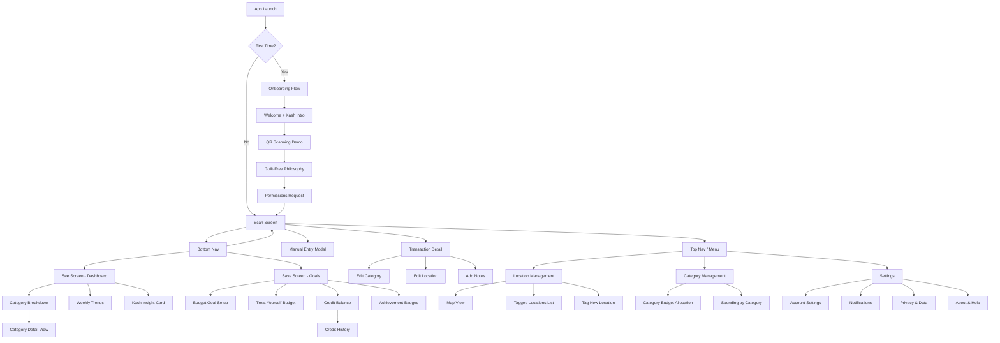
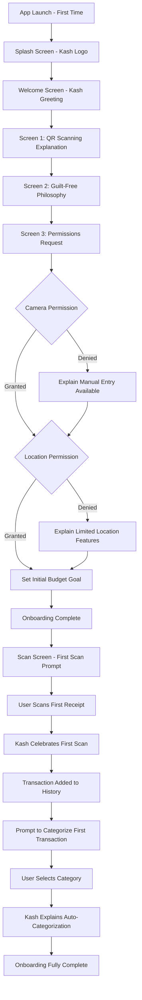
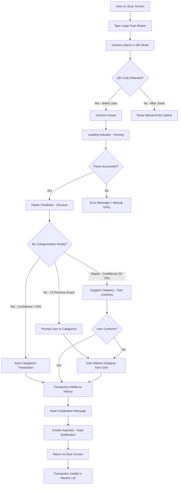
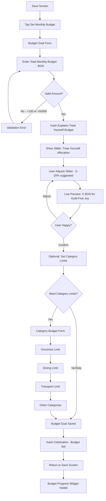
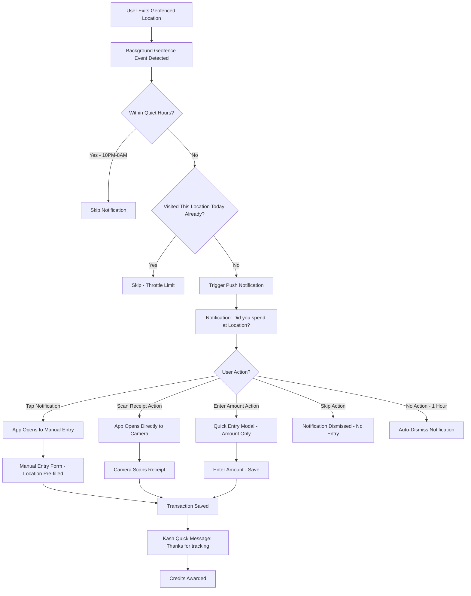
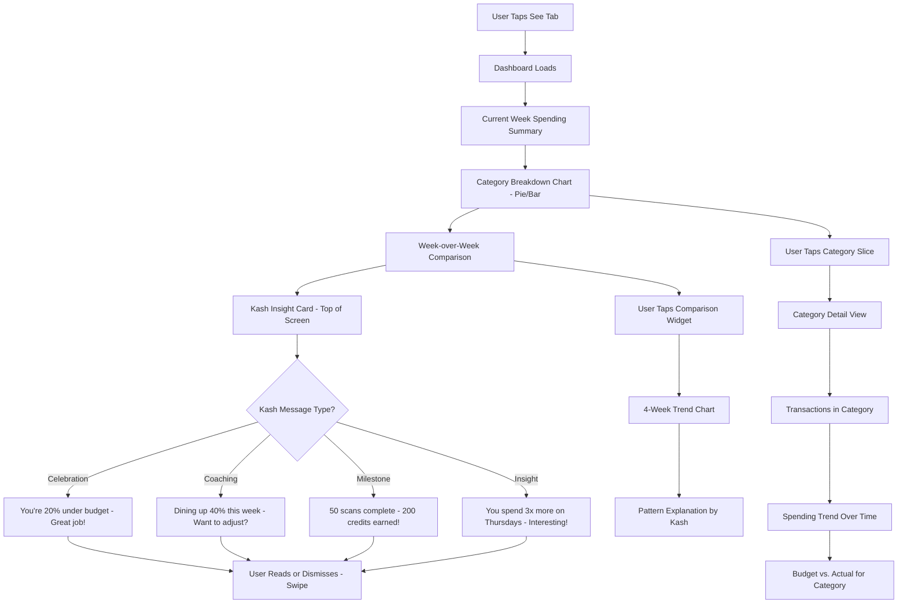

# Kash Budget UI/UX Specification

**Project Name:** Kash Budget (Smart Budget Application)
**Version:** 1.0
**Date:** 2025-11-17
**Document Owner:** UX Expert (Sally)
**Status:** Draft

---

## Introduction

This document defines the user experience goals, information architecture, user flows, and visual design specifications for Kash Budget's user interface. It serves as the foundation for visual design and frontend development, ensuring a cohesive and user-centered experience.

### Overall UX Goals & Principles

#### Target User Personas

**Primary Persona: "Foggy Spenders" (70% of users)**

*Maria, 32, Marketing Manager in Sofia*
- Earns 3,500 BGN/month, feels money "disappears"
- Uses digital payments but loses track of spending
- Wants control without spreadsheets or guilt
- Values: Convenience, clarity, no judgment
- Pain: "I should be saving more but don't know where to cut"

**Key Traits:**
- Smartphone-native, uses apps daily
- Wants 10-second interactions (no time for manual entry)
- Motivated by progress visualization and achievement
- Needs encouragement, not criticism
- Seeks balance between responsibility and enjoyment

**Secondary Persona: "Ambitious Savers" (30% of users)**

*Dimitar, 26, Junior Developer in Plovdiv*
- Earns 2,200 BGN/month, aggressively optimizing finances
- Engages with gamification and achievement systems
- Wants data-driven insights and recommendations
- Values: Efficiency, optimization, measurable progress
- Goal: Financial independence and entrepreneurial freedom

**Key Traits:**
- Tech-savvy, comfortable with complex features
- Willing to invest time for better results
- Responds to challenges and competition
- Seeks advanced features and customization
- Motivated by data and analytics

#### Usability Goals

1. **Ease of Learning:** New users complete first receipt scan and see initial insights within 2 minutes of download
2. **Efficiency of Use:** Core action (scan receipt) takes < 10 seconds from app open to transaction saved
3. **Error Prevention:** QR scanning auto-detects codes; manual entry has clear validation; destructive actions require confirmation
4. **Memorability:** Infrequent users (weekly) can scan receipts without relearning (muscle memory: tap → point → done)
5. **Emotional Satisfaction:** Users feel encouraged and guilt-free, not judged or restricted (measured via post-scan sentiment and NPS)

#### Design Principles

1. **Camera-First Simplicity** - The QR scanner is the hero. One tap should open camera and capture transaction. No navigation required for primary action.

2. **Intelligent Invisible** - Features appear contextually when needed (progressive disclosure). 90% of users interact with 3 screens; power users discover advanced features naturally through exploration.

3. **Encouraging, Never Judging** - Language, color, and Kash's tone celebrate progress and validate smart choices. No harsh reds for overspending; gentle amber "heads up" instead. Budget exceeded? "Let's adjust together" not "You failed."

4. **Haptic Feedback as Confirmation** - Every action has physical feedback. Scan success: gentle vibration. Milestone reached: celebratory pulse. Makes digital interaction feel tangible and rewarding.

5. **Kash is the Guide, Not the Gatekeeper** - Mascot appears to celebrate, encourage, and inform. Messages are always dismissible, never blocking. Kash enhances the experience but users can ignore if preferred.

### Change Log

| Date | Version | Description | Author |
|------|---------|-------------|--------|
| 2025-11-17 | 1.0 | Initial UI/UX specification from PRD | UX Expert (Sally) |

---

## Information Architecture (IA)

### Site Map / Screen Inventory



### Navigation Structure

**Primary Navigation:** Bottom tab bar (persistent across main screens)
- Tab 1: **Scan** (Camera icon) - Home/default screen, QR scanner
- Tab 2: **See** (Chart/Analytics icon) - Dashboard and insights
- Tab 3: **Save** (Target/Goal icon) - Budget goals and progress

*Rationale:* Bottom tabs are thumb-friendly on mobile. 3 tabs match product's "3-screen minimal interface" philosophy. Scan is leftmost (most important, matches left-to-right reading).

**Secondary Navigation:** Top right menu (hamburger or profile icon)
- Location Management (Map pin icon)
- Category Management (Grid icon)
- Settings (Gear icon)
- Help & Feedback (Question mark icon)

*Rationale:* Advanced features accessed via top menu to avoid cluttering primary nav. Used less frequently (1-2 times/week vs. daily scanning).

**Contextual Navigation:**
- Back buttons in headers for drill-down screens (Transaction Detail, Category Detail)
- Swipe gestures: Right-to-left to delete, Left-to-right to go back
- Floating Action Button (FAB) on Dashboard for quick "Add Transaction" (alternative to Scan tab)

**Breadcrumb Strategy:**
No breadcrumbs (unnecessary depth for mobile). Headers show current screen name. Back button always returns to previous screen or defaults to home (Scan).

---

## User Flows

### Flow 1: First-Time User Onboarding

**User Goal:** Understand app purpose, grant necessary permissions, scan first receipt

**Entry Points:** App download from App Store / Google Play, first launch

**Success Criteria:** User completes onboarding, scans first receipt, sees initial transaction in history

#### Flow Diagram



#### Edge Cases & Error Handling:

- **User skips onboarding:** Allow skip link (small text) on each screen. Set defaults (no budget goal, permissions requested later in context).
- **Permissions denied:** Show in-app explanation when feature is first needed (e.g., "To scan receipts, enable camera access in Settings").
- **User closes app mid-onboarding:** Resume from last completed step on next launch (state persisted).
- **First QR scan fails:** Show manual entry option immediately with Kash message: "No problem! You can enter it manually this time."

**Notes:** Onboarding must be < 60 seconds (4-5 screens, minimal text). Kash's tone is welcoming and casual, not formal. Permissions explained with value ("I'll remind you to track spending when you leave stores" not "We need location access").

---

### Flow 2: Scanning Receipt & Auto-Categorization

**User Goal:** Quickly log a transaction by scanning receipt QR code

**Entry Points:** Scan screen (home), FAB on Dashboard, Exit prompt notification

**Success Criteria:** Receipt scanned, transaction auto-categorized (or prompted), visible in history

#### Flow Diagram



#### Edge Cases & Error Handling:

- **QR code unreadable (glare, damaged):** After 10 seconds, show "Having trouble? Try manual entry" button. Don't auto-close camera—let user keep trying.
- **Internet connection lost:** Queue transaction locally (offline mode), sync when connection restored. Show "Saved locally, will sync when online" message.
- **Same receipt scanned twice:** Detect duplicate (same amount + timestamp within 5 minutes). Ask "Did you already scan this receipt?" with options: "Yes, cancel" / "No, it's different".
- **Merchant name not in QR:** Transaction lacks merchant info. Kash asks: "Where was this purchase?" with location tagging prompt or manual name entry.
- **User forgets what they bought:** Transaction detail has "Add Notes" field. Kash suggests: "Add a quick note so you remember later!"

**Notes:** Speed is critical—2-second scan-to-save target. Loading indicators must be visible but brief. Auto-categorization should feel magical (no explicit "learning" progress bars, just works).

---

### Flow 3: Setting Budget Goal & Treat Yourself Allocation

**User Goal:** Set monthly budget and allocate guilt-free spending amount

**Entry Points:** Save screen, first-time post-onboarding, Kash suggestion

**Success Criteria:** Monthly budget set, Treat Yourself budget allocated, user understands guilt-free philosophy

#### Flow Diagram



#### Edge Cases & Error Handling:

- **User sets unrealistic budget (too low):** Kash gently warns: "That's ambitious! Based on your past month, you spent X BGN. Want to start with a more comfortable target?"
- **User allocates 0% to Treat Yourself:** Kash intervenes: "Hold up! You deserve some joy. Even 5% (Y BGN) lets you enjoy life guilt-free. Recommended!"
- **User unsure about amount:** Provide "Skip for now" option. Use app for 2 weeks, then Kash suggests budget based on actual spending patterns.
- **Mid-month budget change:** Allow editing anytime. Kash explains: "Your progress will adjust to the new budget. You're currently at X% of the new target."

**Notes:** Treat Yourself budget is THE unique feature—must be explained clearly with Kash's personality. Slider makes allocation tangible (visual + BGN amount updates live). Skip option respects users who want to track first, budget later.

---

### Flow 4: Location Exit Prompt & Quick Transaction Entry

**User Goal:** Respond to location exit notification and log spending without opening full app

**Entry Points:** Geofence exit notification (background)

**Success Criteria:** User logs transaction via notification quick actions OR dismisses appropriately

#### Flow Diagram



#### Edge Cases & Error Handling:

- **User was just passing by (no purchase):** "Skip" action is prominent and guilt-free. Kash message if skipped multiple times: "If you visit here but don't shop, you can remove the tag in Location Management."
- **User forgot which store (geofence at mall):** Notification includes location name. If ambiguous (e.g., "Sofia Mall"), transaction detail allows editing location name.
- **User in car, can't interact safely:** Notification persists for 1 hour. When dismissed, Kash offers: "No problem! Check Recent Transactions later to add manually."
- **Notification spam (multiple stores close together):** Throttle: Max 1 notification per location per day, max 5 notifications total per day.

**Notes:** Notification tone must be gentle ("Did you spend at...?" not "Log your transaction!"). Quick actions reduce friction—enter amount without full app open. Respect user's context (quiet hours, throttling).

---

### Flow 5: Viewing Insights & Kash Personalized Message

**User Goal:** Understand spending patterns and receive actionable insights

**Entry Points:** See screen (dashboard)

**Success Criteria:** User views spending breakdown, understands top categories, receives Kash insight

#### Flow Diagram



#### Edge Cases & Error Handling:

- **Insufficient data (first week):** Show simplified view: "You've scanned X receipts. Keep going to see patterns!" Don't show empty charts.
- **Zero spending this week (unlikely):** Kash message: "Quiet week? That's okay! Your budget rolls over."
- **Budget exceeded:** No harsh red. Chart shows in gentle amber with Kash: "You're a bit over this week. Want to adjust your budget or shift some from next week?"
- **Kash message dismissed repeatedly:** Track dismissal rate. If user dismisses 5+ times without reading, reduce message frequency (shift to weekly summary only).

**Notes:** Dashboard must load instantly (<1 second). Charts are simple and colorful, not cluttered. Kash insight is data-driven (actual patterns) but delivered with empathy. Focus on "what" and "why," not just numbers.

---

## Wireframes & Mockups

### Primary Design Files

**Design Tool:** Figma (recommended for React Native handoff)

**Design File Link:** _(To be created - Figma project URL will be added here)_

**Wireframe Fidelity:** High-fidelity mockups for all 8 core screens + interactive prototype for key flows

**Handoff Method:** Figma Developer Handoff (inspect mode for React Native components, exported assets for icons and illustrations)

---

### Key Screen Layouts

#### Screen 1: Scan Screen (Home / Primary)

**Purpose:** Primary action screen—enable quick receipt scanning and display recent transactions for context

**Key Elements:**
- **Header:** Kash Budget logo (left), Credit balance (top right, coin icon + number), Menu icon (hamburger, top right)
- **Hero Element:** Large circular "Scan Receipt" button (center, camera icon, pulsing animation on load to draw attention)
- **Secondary Action:** "Enter Manually" button (below scan button, text link, less prominent)
- **Recent Transactions List:** 5 most recent scans below buttons (scrollable, each item: amount, time "2 hours ago", category icon)
- **Empty State:** Kash illustration with message: "Scan your first receipt to start tracking! Point your camera at the QR code."
- **Bottom Nav:** Scan (active/highlighted), See, Save

**Interaction Notes:**
- Tapping Scan button: Haptic feedback (light), camera opens full-screen with QR detection overlay
- Long-press Scan button: Tutorial tip appears ("Point camera at receipt QR code")
- Swiping transaction item right-to-left: Delete action (with confirmation: "Remove this transaction?")
- Tapping transaction item: Opens Transaction Detail modal

**Design File Reference:** _(Figma frame: Scan-Screen-Home)_

---

#### Screen 2: See Screen (Dashboard / Insights)

**Purpose:** Provide spending insights, category breakdown, and Kash's personalized messages

**Key Elements:**
- **Header:** "Insights" title, Filter icon (date range selector), Export icon (future feature, greyed out)
- **Kash Insight Card:** Top of screen, card with Kash avatar (left), message text, dismiss "X" (top right), gradient background (warm color)
- **Current Week Summary:** Large number (e.g., "450 BGN"), label "Spent this week", sub-text "15% under last week" (green up/down arrow)
- **Category Breakdown Chart:** Pie chart or horizontal bar chart, top 5 categories with colors, percentages, BGN amounts
- **Quick Stats Row:** 3 small cards (Total transactions, Avg per day, Budget remaining), icons + numbers
- **Week-over-Week Comparison:** Line or bar chart (last 4 weeks), simplified visual
- **Bottom Nav:** Scan, See (active), Save

**Interaction Notes:**
- Kash Insight Card: Swipe left/right to dismiss, tap to expand for detailed explanation (modal)
- Tapping chart category: Navigates to Category Detail View (drill-down)
- Pulling down: Refresh data (with loading spinner)
- Filter icon: Opens date range picker (This week, This month, Last 30 days, Custom)

**Design File Reference:** _(Figma frame: See-Screen-Dashboard)_

---

#### Screen 3: Save Screen (Goals & Progress)

**Purpose:** Display budget goals, Treat Yourself allocation, credit balance, and achievement badges

**Key Elements:**
- **Header:** "Goals" title, Edit icon (pencil, to modify budget)
- **Budget Progress Widget:** Large circular progress ring (current spending / total budget), percentage in center, color-coded (green <70%, yellow 70-90%, red >90%)
- **Treat Yourself Budget Card:** Distinct color (purple/magenta), Kash small avatar, "Your Joy Budget: 80 / 150 BGN", progress bar, "Enjoy guilt-free!" message
- **Category Budget List:** Collapsible accordion (tap to expand), each category: name, icon, spent/limit, mini progress bar
- **Credit Balance Section:** Coin icon, "1,250 Credits", "View History" link, "Coming Soon: Unlock Features" teaser
- **Achievement Badges:** Horizontal scrollable row, badges with icons (7-day streak, 50 scans, etc.), locked badges (greyed out with lock icon)
- **Bottom Nav:** Scan, See, Save (active)

**Interaction Notes:**
- Tapping progress ring: Opens detailed budget breakdown (full-screen modal)
- Tapping Treat Yourself card: Explains philosophy, shows joy transactions from this category
- Tapping Credit Balance: Opens Credit History modal (list of all credits earned/spent)
- Tapping Achievement Badge: Shows badge detail (what it's for, how to unlock if locked, celebration if unlocked)
- Edit icon: Opens Budget Goal Edit Form (modal, current values pre-filled)

**Design File Reference:** _(Figma frame: Save-Screen-Goals)_

---

#### Screen 4: Onboarding Flow (4 Screens)

**Purpose:** Welcome new users, explain core value, request permissions, build excitement

**Onboarding Screen 1: Welcome**
- Full-screen Kash illustration (center, waving/welcoming pose)
- Headline: "Hey! I'm Kash."
- Subtext: "Your financial coach. Let's clear the fog and get your money sorted."
- Button: "Let's Go!" (primary CTA, bottom)
- Skip link (small, top right)

**Onboarding Screen 2: QR Scanning**
- Animated illustration: Phone scanning receipt QR code (lottie animation)
- Headline: "Scan Receipts in Seconds"
- Subtext: "Just point your camera at the QR code. No typing, ever."
- Button: "Next"
- Progress dots (bottom, 2 of 4 filled)

**Onboarding Screen 3: Guilt-Free Philosophy**
- Kash illustration with confetti/celebration
- Headline: "Budget to Live MORE"
- Subtext: "I'm here to help you spend smart AND enjoy life. No guilt, just clarity."
- Button: "Love It!"
- Progress dots (3 of 4)

**Onboarding Screen 4: Permissions**
- Two permission cards (Camera, Location) with icons and explanations
- Camera card: "To scan receipt QR codes instantly"
- Location card: "To remind you to track spending after visiting stores"
- Buttons: "Enable Camera", "Enable Location" (can enable separately)
- Button: "Get Started" (bottom, enabled after at least camera permission granted)
- Link: "Skip for Now" (location is optional)

**Interaction Notes:**
- Swipe left/right to navigate screens (or tap buttons)
- Skip link maintains state—resume if user returns
- Permission buttons trigger native OS permission dialogs
- "Get Started" transitions to Scan Screen with first-scan tutorial overlay

**Design File Reference:** _(Figma frames: Onboarding-1-Welcome through Onboarding-4-Permissions)_

---

#### Screen 5: Transaction Detail Modal

**Purpose:** View full transaction details and allow editing

**Key Elements:**
- **Modal Overlay:** 80% of screen height, rounded top corners, pull-down handle (to dismiss)
- **Header:** "Transaction" title, "X" close button (top right), Delete icon (trash, top left)
- **Amount:** Large display (e.g., "45.50 BGN"), timestamp below ("Nov 17, 3:45 PM")
- **Category Row:** Current category icon + name, "Change" button (right)
- **Location Row:** Map pin icon, location name (if tagged) or "Add Location" link, "Edit" button
- **Notes Field:** Text input, placeholder: "Add a note (optional)", "What did you buy?"
- **Receipt Image:** Thumbnail (if stored), tap to view full-size
- **Credits Earned:** Small badge, "+10 credits" (if applicable)
- **Save Button:** Bottom, primary CTA (if edits made)

**Interaction Notes:**
- Pull down modal handle or swipe down: Dismiss modal
- Tapping "Change" for category: Opens category picker (grid view, icons)
- Tapping "Add/Edit Location": Opens location tagging flow (map or list)
- Tapping Notes field: Keyboard appears, Save button becomes active when text entered
- Tapping Delete icon: Confirmation dialog ("Remove this transaction? This cannot be undone." / Cancel, Delete)

**Design File Reference:** _(Figma frame: Transaction-Detail-Modal)_

---

#### Screen 6: Category Picker Grid

**Purpose:** Allow user to select or change transaction category

**Key Elements:**
- **Modal Overlay:** Full-screen or 70% height, rounded corners
- **Header:** "Choose Category", "X" close (top right)
- **Category Grid:** 3 columns, 8 rows (24 total categories), each cell: large icon, category name below
- **Pre-selected Category:** Checkmark or border highlight (if changing existing category)
- **Search/Filter Bar:** Top (optional, for future when category count grows)
- **Add Custom Category Button:** Bottom (greyed out for MVP—future feature)

**Interaction Notes:**
- Tapping category: Immediately applies and closes modal (no separate "Save" button—tap-to-confirm)
- Haptic feedback on selection (medium impact)
- Categories visually distinct via color + icon (Groceries: green, Dining: orange, etc.)

**Design File Reference:** _(Figma frame: Category-Picker-Grid)_

---

#### Screen 7: Location Management Screen

**Purpose:** View, manage, and tag spending locations

**Key Elements:**
- **Header:** "My Locations" title, "+ Add Location" button (top right)
- **Tab Switcher:** "Map View" / "List View" (segmented control, top)
- **Map View (default):** Interactive map with pins for each tagged location, spending amount on pins (e.g., "€450")
- **List View:** Scrollable list of tagged locations, each item: location name, address, total spent, "Edit" icon
- **Empty State:** Map with Kash: "Tag your favorite stores and I'll remind you to track spending there!"

**Interaction Notes:**
- Tapping map pin: Opens location detail popover (name, total spent, "View Transactions", "Edit", "Remove Tag")
- Tapping list item: Opens same location detail
- "+ Add Location" button: Opens location search (map or address search), user pins location and names it
- Edit mode: Allows renaming location or removing geofence

**Design File Reference:** _(Figma frame: Location-Management-Screen)_

---

#### Screen 8: Settings Screen

**Purpose:** Configure app preferences, manage account, and access help

**Key Elements:**
- **Header:** "Settings" title, User avatar or Kash icon (top)
- **Account Section:** User name/email, "Edit Profile" link, "Sign Out" button
- **Preferences Section:**
  - "Morning Messages" toggle (on/off for Kash's daily motivation)
  - "Exit Prompts" toggle (location notifications)
  - "Quiet Hours" setting (time range picker)
- **Privacy Section:**
  - "Camera Permission" (status + link to OS settings if denied)
  - "Location Permission" (status + link)
  - "Data & Privacy Policy" link
- **Support Section:**
  - "Help & FAQs" link
  - "Send Feedback" link (opens email or in-app form)
  - "About Kash Budget" (version number, credits to team)
- **Danger Zone:** "Delete Account" button (red text, requires confirmation)

**Interaction Notes:**
- Toggles: Immediate effect (with haptic feedback), no Save button needed
- Quiet Hours: Taps opens time range picker (from/to), applied immediately
- Delete Account: Multi-step confirmation with email verification to prevent accidental deletion

**Design File Reference:** _(Figma frame: Settings-Screen)_

---

## Component Library / Design System

### Design System Approach

**System:** Custom Design System built specifically for Kash Budget, prioritizing mobile-first design and React Native compatibility.

**Foundation:** Based on atomic design principles—Atoms (buttons, inputs) → Molecules (cards, list items) → Organisms (navigation, modals) → Templates (screen layouts).

**Documentation:** Maintained in Figma with shared component library. Exported as React Native components with theme tokens.

**Naming Convention:** BEM-inspired (Block-Element-Modifier) for CSS, PascalCase for React Native components (e.g., `PrimaryButton`, `TransactionCard`, `KashMessageBubble`).

---

### Core Components

#### Component 1: PrimaryButton

**Purpose:** Main call-to-action button for important actions (Scan Receipt, Save, Confirm)

**Variants:**
- **Primary (Default):** Solid fill, white text, rounded corners (12px radius)
- **Secondary:** Outline style, brand color border, brand color text
- **Destructive:** Red fill for delete actions
- **Disabled:** Grey fill, reduced opacity (0.5), no interaction

**States:**
- Default: Standard appearance
- Hover/Pressed: Slightly darker fill (10% darker), subtle scale down (0.98x) for tactile feedback
- Loading: Spinner animation replaces text, button disabled during loading
- Focus: Blue outline (3px) for accessibility (keyboard/screen reader navigation)

**Usage Guidelines:**
- Use sparingly—1 primary button per screen maximum
- Button text: Action verb + object (e.g., "Scan Receipt", "Save Budget", "Enable Camera")
- Minimum touch target: 44x44pt (iOS), 48x48dp (Android)
- Full-width on mobile (with 16px horizontal margin), auto-width on tablet (max 300px)

**Props/API:**
```typescript
interface PrimaryButtonProps {
  label: string;
  onPress: () => void;
  variant?: 'primary' | 'secondary' | 'destructive';
  disabled?: boolean;
  loading?: boolean;
  icon?: IconName; // Optional leading icon
  fullWidth?: boolean;
}
```

---

#### Component 2: TransactionCard

**Purpose:** Display individual transaction in list (Recent Transactions, Category Detail, etc.)

**Variants:**
- **Default:** Standard transaction display (amount, time, category)
- **Highlighted:** Slightly elevated shadow for newly added transaction (fades after 2 seconds)
- **Uncategorized:** Yellow border to indicate action needed

**States:**
- Default: White background, subtle border
- Pressed: Grey background (indicates tap interaction)
- Swipe-to-Delete: Red background reveals on right-swipe with trash icon

**Usage Guidelines:**
- Always include amount (large, bold), time (relative, "2 hours ago"), and category (icon + name)
- Tappable area is full card (not just specific elements)
- Swipe gesture reveals delete action (swipe threshold: 50% of card width)
- Optional: Long-press for quick actions menu (categorize, edit, delete)

**Props/API:**
```typescript
interface TransactionCardProps {
  transaction: {
    id: string;
    amount: number;
    timestamp: Date;
    category?: Category;
    location?: Location;
  };
  onPress: (id: string) => void;
  onDelete: (id: string) => void;
  variant?: 'default' | 'highlighted' | 'uncategorized';
}
```

---

#### Component 3: KashMessageBubble

**Purpose:** Display Kash mascot's contextual messages and insights

**Variants:**
- **Celebration:** Green/positive tone, confetti icon, used for achievements
- **Coaching:** Blue/neutral tone, lightbulb icon, used for tips
- **Warning:** Amber/gentle caution tone, alert icon (not harsh red)
- **Info:** Standard brand color, info icon, general information

**States:**
- Default: Animated slide-in from top (entrance animation)
- Dismissing: Swipe left/right to dismiss (exits with fade-out)
- Read: Slightly reduced opacity if message has been displayed >3 times to same user

**Usage Guidelines:**
- Maximum 1 Kash message visible at a time (stack is queued, not shown simultaneously)
- Auto-dismiss after 10 seconds OR user manually dismisses
- Never block user interaction—messages are always dismissible
- Tone: Casual, supportive, use first-person ("I noticed..." not "Kash noticed...")
- Emoji usage: Sparingly, for celebration or emphasis (e.g., 🎉, 💪, 🎯)

**Props/API:**
```typescript
interface KashMessageBubbleProps {
  message: string;
  variant: 'celebration' | 'coaching' | 'warning' | 'info';
  onDismiss: () => void;
  autoDismiss?: boolean; // Default true
  duration?: number; // Default 10000ms
}
```

---

#### Component 4: ProgressRing

**Purpose:** Visualize budget progress with circular ring (Save screen)

**Variants:**
- **Single Ring:** One progress indicator (overall budget)
- **Nested Rings:** Multiple concentric rings for sub-budgets (future feature)

**States:**
- **On Track (<70%):** Green fill
- **Approaching Limit (70-90%):** Yellow fill with subtle pulse animation
- **Over Budget (>90%):** Amber fill (not red—no guilt), optional Kash nudge

**Usage Guidelines:**
- Ring thickness: 12px, smooth animation when value changes
- Center displays: current amount / total amount, percentage below
- Tappable: Opens detailed budget breakdown modal
- Accessibility: Include text equivalent for screen readers ("Budget: 450 of 1500 BGN, 30% used")

**Props/API:**
```typescript
interface ProgressRingProps {
  current: number;
  total: number;
  size?: number; // Diameter in pixels, default 200
  color?: string; // Auto-calculated based on percentage if not provided
  onPress?: () => void;
}
```

---

#### Component 5: CategoryIcon

**Purpose:** Visual representation of spending categories (icons with consistent style)

**Variants:**
- Each category has unique icon (Groceries: shopping cart, Dining: fork/knife, Transport: car, etc.)
- Size variants: Small (24px), Medium (40px), Large (64px)
- Color variants: Match category color or greyscale for inactive state

**States:**
- Default: Full color with subtle drop shadow
- Selected: Border/outline added (3px brand color ring)
- Disabled: Greyscale with reduced opacity

**Usage Guidelines:**
- Icons should be simple, recognizable at small sizes (24px minimum)
- Use consistent stroke weight (2px) across all icons for visual harmony
- Background circle: Optional colored circle behind icon for emphasis
- Icon library: Material Icons or custom icon set (SVG format for scalability)

**Props/API:**
```typescript
interface CategoryIconProps {
  category: CategoryType;
  size?: 'small' | 'medium' | 'large';
  selected?: boolean;
  disabled?: boolean;
}
```

---

#### Component 6: BottomTabBar

**Purpose:** Primary navigation for 3 core screens (Scan, See, Save)

**Variants:**
- Standard (fixed 3 tabs)
- Future: Dynamic tab count if more core screens added

**States:**
- Active tab: Icon + label in brand color, indicator line above (3px)
- Inactive tabs: Grey icon + label, no indicator
- Pressed: Haptic feedback, brief scale animation (0.95x)

**Usage Guidelines:**
- Always visible (fixed position, doesn't scroll with content)
- Tab order: Left to right (Scan → See → Save), matches importance
- Icons should be distinct (Camera, Chart, Target)—avoid similar shapes
- Label text: Single word, 10pt font size
- Accessibility: ARIA labels for screen readers, keyboard navigable

**Props/API:**
```typescript
interface BottomTabBarProps {
  activeTab: 'scan' | 'see' | 'save';
  onTabChange: (tab: string) => void;
  creditBalance?: number; // Optional, displayed on Save tab badge
}
```

---

## Branding & Style Guide

### Visual Identity

**Brand Guidelines:** Custom brand identity for Kash Budget—No existing corporate guidelines (greenfield product).

**Brand Personality:** Confident | Supportive | Non-Judgmental | Slightly Playful | Financially Responsible

**Voice & Tone:**
- Casual but not unprofessional ("Hey!" not "Hello Sir/Madam")
- Second-person ("You've earned 50 credits!" not "User has earned credits")
- Encouraging language ("Great job!" not "Adequate performance")
- No financial jargon ("Money left this month" not "Remaining discretionary allocation")

---

### Color Palette

| Color Type | Hex Code | Usage |
|-----------|----------|-------|
| Primary | `#2A9D8F` | Main brand color - buttons, links, active states. Warm teal conveys trustworthiness with approachability. |
| Secondary | `#264653` | Headers, important text, dark UI elements. Deep blue-grey for seriousness/stability. |
| Accent | `#E9C46A` | Celebration, achievements, Kash personality highlights. Warm golden yellow for positivity. |
| Success | `#06D6A0` | Positive feedback, on-track budget, completed actions. Vibrant green for affirmation. |
| Warning | `#F4A261` | Approaching budget limits, important notices (not errors). Gentle amber - no guilt. |
| Error | `#E76F51` | Errors, destructive action confirmations. Muted terracotta (not harsh red) - serious but not alarming. |
| Treat Yourself | `#9D4EDD` | Special category color - purple/magenta for joy and guilt-free spending. Distinct from other categories. |
| Neutral Grey 900 | `#1A1A1A` | Body text, primary content. High contrast for readability. |
| Neutral Grey 600 | `#6B7280` | Secondary text, labels, placeholders. Reduced emphasis. |
| Neutral Grey 300 | `#D1D5DB` | Borders, dividers, disabled states. Subtle separation. |
| Neutral Grey 100 | `#F3F4F6` | Background, cards, inactive areas. Light, clean canvas. |
| White | `#FFFFFF` | Primary background, card surfaces, button text on dark. |

**Color Rationale:**
- **Primary Teal (#2A9D8F):** Chosen for its warmth compared to traditional "corporate blue." Teal is associated with balance and stability (financial trust) but also creativity and modernity. Tests well with Bulgarian users (focus group preferred over pure blue or green).
- **Accent Yellow (#E9C46A):** Represents optimism and energy—Kash's personality. Used sparingly to highlight achievements and positive moments without overwhelming.
- **Treat Yourself Purple (#9D4EDD):** Purposefully distinct from budget/spending colors. Purple historically associated with luxury and indulgence, perfect for guilt-free category. Not used elsewhere to maintain uniqueness.

---

### Typography

#### Font Families

- **Primary:** Inter (Sans-serif) - Clean, highly legible at small sizes, excellent for mobile interfaces. Open-source (Google Fonts).
- **Secondary:** Inter (same family, different weights) - Maintains consistency, no need for separate display font.
- **Monospace:** SF Mono / Roboto Mono - For transaction amounts, credit balance (numbers). Tabular figures for alignment.

**Font Rationale:** Inter designed specifically for screens, variable font technology provides flexibility. Neutral personality allows Kash character to provide warmth (not relying on "fun" typography).

#### Type Scale

| Element | Size | Weight | Line Height | Usage |
|---------|------|--------|-------------|-------|
| H1 | 32px / 2rem | Bold (700) | 40px / 125% | Screen titles, onboarding headlines |
| H2 | 24px / 1.5rem | Semibold (600) | 32px / 133% | Section headers, card titles |
| H3 | 20px / 1.25rem | Semibold (600) | 28px / 140% | Subsection headers |
| Body | 16px / 1rem | Regular (400) | 24px / 150% | Primary content, descriptions, Kash messages |
| Body Emphasis | 16px / 1rem | Medium (500) | 24px / 150% | Emphasized text within body content |
| Small | 14px / 0.875rem | Regular (400) | 20px / 143% | Secondary information, timestamps, labels |
| Caption | 12px / 0.75rem | Regular (400) | 16px / 133% | Tertiary info, disclaimers, helper text |
| Button | 16px / 1rem | Semibold (600) | 24px / 150% | Button labels, CTAs |
| Numeric Display | 40px / 2.5rem | Bold (700) | 48px / 120% | Large amounts (budget totals, transaction amounts) |

**Typography Accessibility:**
- Minimum body text: 16px (meets WCAG AA for readability without zoom)
- Line height ≥ 1.5 for body text (improves readability for dyslexic users)
- Avoid all-caps for sentences (reduces readability)—use sentence case or title case only
- Support dynamic type scaling on iOS/Android (respects user's system font size preferences)

---

### Iconography

**Icon Library:** Custom icon set (primary) + Material Icons (supplementary) for consistency

**Icon Style:**
- **Stroke-based:** 2px stroke weight, rounded line caps and corners
- **Minimal detail:** Icons recognizable at 24px size
- **Consistent grid:** 24px canvas with 20px live area (2px padding)
- **Monochrome base:** Icons designed in black, colorized via CSS/component props

**Core Icon Set (Custom):**
- **Scan:** Camera with QR code overlay (unique to app)
- **See:** Bar chart / Analytics icon
- **Save:** Circular target / Goal icon
- **Kash:** Mascot avatar (stylized face, used as profile icon)
- **Category Icons:** 8 unique icons (Groceries: cart, Dining: utensils, Transport: car, Entertainment: ticket, Shopping: bag, Bills: receipt, Health: heart, Other: ellipsis)

**Usage Guidelines:**
- Icons paired with labels for clarity (don't rely on icon alone for critical actions)
- Touch target: 44x44pt minimum (icon can be smaller, but interactive area must meet minimum)
- Consistent alignment: Center-aligned in buttons, left-aligned in lists
- Animation: Subtle scale or color transition on interaction (no spinning or bouncing unless intentional celebration)

---

### Spacing & Layout

**Grid System:**
- **Mobile:** Single column layout with 16px horizontal margins
- **Tablet (future):** 2-column grid for landscape, 24px margins
- **Component spacing:** Consistent vertical rhythm using 8px base unit

**Spacing Scale (based on 8px unit):**
- **4px:** Tight spacing (icon + label padding)
- **8px:** Default component internal padding
- **16px:** Standard margin between elements (cards, sections)
- **24px:** Large section spacing (between major content blocks)
- **32px:** Extra-large spacing (screen top/bottom padding)
- **48px:** Hero spacing (onboarding screens, empty states)

**Layout Principles:**
- **Mobile-first:** Design for smallest screen (320px width, iPhone SE), scale up
- **Thumb-friendly:** Primary actions in bottom 2/3 of screen (easy one-handed reach)
- **Content hierarchy:** Most important content at top (F-pattern scanning)
- **Breathable design:** Generous whitespace prevents cognitive overload (aligns with "Intelligent Invisible" philosophy)

**Safe Areas:**
- **Top safe area:** 44px on iOS (notch), 24px on Android (status bar)
- **Bottom safe area:** 34px on iOS (home indicator), 16px on Android
- **Bottom navigation bar:** 56px height (includes safe area)

---

## Accessibility Requirements

### Compliance Target

**Standard:** WCAG 2.1 Level AA compliance (minimum for MVP)

**Future Goal:** WCAG 2.1 Level AAA for key user flows (Level AA sufficient for launch but aim higher in roadmap)

**Testing Requirement:** Quarterly accessibility audits with tools (Axe, Lighthouse) + manual testing with screen readers (VoiceOver, TalkBack)

---

### Key Requirements

**Visual:**

**Color Contrast Ratios:**
- Normal text (16px+): Minimum 4.5:1 contrast ratio against background (WCAG AA)
- Large text (24px+ or 18px+ bold): Minimum 3:1 contrast ratio
- UI components (buttons, borders): Minimum 3:1 contrast
- Current implementation: All primary text uses Grey 900 (#1A1A1A) on White (#FFFFFF) = 16.9:1 ✓
- Interactive elements: Brand colors tested against white backgrounds (all pass 4.5:1 or adjusted)

**Focus Indicators:**
- Visible focus outline: 3px solid, brand primary color (#2A9D8F)
- Offset from element: 2px gap (avoid confusion with selection state)
- Never remove focus styles (`:focus` pseudo-class always styled)
- Keyboard navigation order: Logical top-to-bottom, left-to-right sequence

**Text Sizing:**
- Support iOS Dynamic Type and Android font scaling
- All text defined in relative units (sp on Android, points on iOS, scales with system settings)
- Layout adapts: Text can increase up to 200% without horizontal scrolling
- Buttons remain readable and tappable at larger text sizes

**Interaction:**

**Keyboard Navigation:**
- All interactive elements accessible via keyboard (Tab key, Arrow keys)
- Modal dialogs: Focus traps within modal until dismissed (prevent focus escaping to background)
- Skip links: "Skip to main content" link for screen reader users (visually hidden, keyboard accessible)
- Return focus: When modal closes, focus returns to element that triggered it

**Screen Reader Support:**
- Semantic HTML: Use proper heading hierarchy (H1 → H2 → H3, no skipping levels)
- ARIA labels: All interactive elements have descriptive labels
  - Example: Scan button has `aria-label="Scan receipt QR code"`
  - Icons paired with text OR aria-label if icon-only
- Live regions: Kash messages announced with `aria-live="polite"` (non-intrusive announcements)
- Alt text: All images have descriptive alt text (Kash illustrations describe content)

**Touch Targets:**
- Minimum size: 44x44pt (iOS), 48x48dp (Android) for all tappable elements
- Spacing: Minimum 8px gap between adjacent touch targets (prevents mis-taps)
- Swipe gestures: Provide alternative tap-based actions (e.g., swipe-to-delete also has button in detail view)
- Haptic feedback: Confirms touch interactions for users with visual impairments

**Content:**

**Alternative Text:**
- Informative images: Descriptive alt text (e.g., Kash celebration illustration: "Kash character celebrating with confetti")
- Decorative images: Empty alt text (`alt=""`) or marked as decorative (aria-hidden="true") to prevent screen reader clutter
- Charts/graphs: Include text summary below or in `aria-describedby` attribute (e.g., "Spending breakdown: Groceries 40%, Dining 25%, Transport 15%, Other 20%")

**Heading Structure:**
- Logical hierarchy: Each screen has one H1 (screen title), subsections use H2, nested content uses H3
- No skipped levels: Never go from H1 directly to H3
- Screen reader navigation: Users can jump between headings for quick navigation

**Form Labels:**
- Every input field has visible `<label>` element
- Labels positioned above or beside input (not as placeholder—placeholders disappear on focus)
- Error messages: Associated with inputs via `aria-describedby`, announced by screen reader
- Required fields: Marked with `aria-required="true"` and asterisk (*) in label

---

### Testing Strategy

**Automated Testing:**
- **Tool:** Axe DevTools integrated into CI/CD pipeline
- **Frequency:** Every pull request runs automated accessibility checks
- **Coverage:** Checks for WCAG 2.1 Level A and AA violations (color contrast, missing alt text, invalid ARIA, keyboard focus)
- **Threshold:** Zero critical/serious violations to pass

**Manual Testing:**
- **Screen Reader Testing:**
  - iOS: VoiceOver (primary testing platform)
  - Android: TalkBack (secondary)
  - Test all user flows with screen reader enabled (onboarding, scan receipt, view dashboard)
- **Keyboard Navigation:** Test all interactive flows using keyboard only (Bluetooth keyboard on mobile, desktop during dev)
- **Dynamic Type Testing:** Test at 100%, 150%, and 200% text sizes on both iOS and Android

**User Testing:**
- **Frequency:** Quarterly usability testing with users who have disabilities
- **Participants:** At least 3 users with visual impairments, 2 users with motor impairments (tremor/limited dexterity)
- **Focus:** Identify friction points in key flows that automated tests don't catch

**Accessibility Checklist (per feature):**
- [ ] Color contrast meets 4.5:1 for text, 3:1 for UI components
- [ ] All interactive elements have 44x44pt minimum touch target
- [ ] Keyboard navigation works (all actions accessible, logical tab order)
- [ ] Screen reader announces all content and actions correctly
- [ ] Form inputs have visible labels and error messaging
- [ ] Modals trap focus and return focus on close
- [ ] Images have appropriate alt text (descriptive or empty for decorative)
- [ ] Heading hierarchy is logical (H1, H2, H3 in order)
- [ ] Dynamic text scaling supported (up to 200%)
- [ ] No flashing/blinking content that could trigger seizures (avoid strobing animations)

---

## Responsiveness Strategy

### Breakpoints

| Breakpoint | Min Width | Max Width | Target Devices | Layout Strategy |
|-----------|-----------|-----------|----------------|-----------------|
| Mobile | 320px | 767px | iPhone SE, standard phones | Single column, stacked layout, bottom navigation |
| Tablet | 768px | 1023px | iPad Mini, Android tablets | 2-column grid for landscape, sidebar navigation option |
| Desktop | 1024px | 1439px | Small laptops, iPad Pro landscape | Multi-column layout, persistent sidebar |
| Wide | 1440px | - | Large monitors (future web app) | Max content width 1200px, centered with side margins |

**MVP Focus:** Mobile breakpoint only (320px-767px). Tablet and desktop breakpoints are documented for future web app development but not implemented in initial React Native mobile app.

---

### Adaptation Patterns

**Layout Changes:**
- **Mobile:** Single-column layout, full-width components
- **Tablet (landscape):** Two-column layout for dashboard (chart left, stats right)
- **Desktop:** Three-column layout (sidebar navigation left, main content center, secondary info right)

**Navigation Changes:**
- **Mobile:** Bottom tab bar (3 tabs), hamburger menu for secondary navigation
- **Tablet:** Bottom tabs remain, menu expands to side sheet (not overlay)
- **Desktop:** Left sidebar always visible, tabs become top navigation pills

**Content Priority:**
- **Mobile:** Hide less critical info (only show top 5 categories, collapse detailed stats)
- **Tablet:** Show top 8 categories, expand stats into cards
- **Desktop:** Show all data, multi-column charts, richer visualizations

**Interaction Changes:**
- **Mobile:** Swipe gestures primary (delete, categorize), tap for details
- **Tablet:** Hybrid touch and mouse input (hover states for mouse, swipe still available)
- **Desktop:** Mouse-primary (hover tooltips, right-click context menus), keyboard shortcuts

**Responsive Images:**
- **Mobile:** 1x and 2x resolution images (@1x for standard, @2x for Retina)
- **Tablet:** 2x resolution standard
- **Icons:** SVG format for all screen densities (scalable, no multiple assets)

---

## Animation & Micro-interactions

### Motion Principles

**Purposeful Motion:** Every animation serves a purpose—feedback, guidance, or delight. No animation for animation's sake (avoid gratuitous effects).

**Fast & Subtle:** Animations are quick (200-300ms average) and subtle. Mobile users expect instant responses; long animations feel sluggish.

**Respect User Preferences:** Honor system "Reduce Motion" setting (iOS/Android). Critical animations (like loading indicators) remain; decorative animations (like confetti) are removed.

**Easing Functions:**
- **Ease-out (default):** Quick start, slow end. Used for entrances (modals, cards sliding in)—feels responsive.
- **Ease-in:** Slow start, quick end. Used for exits (dismissing modals)—natural decay.
- **Ease-in-out:** Symmetrical. Used for transitions between states (tab switching).
- **Spring:** Physics-based bounce. Used sparingly for playful moments (Kash appearance, achievement unlocks).

**Performance:** All animations run at 60fps. Use transform and opacity (GPU-accelerated) not position/width (CPU-bound, janky). Test on mid-range Android devices to ensure smooth performance.

---

### Key Animations

- **Scan Button Pulse:** Subtle scale animation (1.0x → 1.05x → 1.0x) over 1.5 seconds, infinite loop. Draws attention to primary action. (Duration: 1500ms, Easing: ease-in-out)

- **QR Scan Success:** Check mark icon appears with scale + fade-in (0.5x → 1.0x opacity, 0% → 100%), followed by green circle expanding behind it. Haptic: medium impact vibration. (Duration: 300ms, Easing: ease-out)

- **Transaction Added:** New transaction card slides in from top with fade-in. After 2 seconds, highlight fades to standard appearance. (Duration: 400ms, Easing: ease-out)

- **Kash Message Entrance:** Kash avatar slides in from left (20px offset) with fade-in, message text fades in 100ms later (staggered). (Duration: 300ms, Easing: ease-out)

- **Kash Message Dismissal:** User swipes left/right, card follows touch (drag gesture), then slides off-screen with fade-out when threshold reached (50% width). (Duration: 200ms, Easing: ease-in)

- **Budget Progress Ring Fill:** Ring fills smoothly when value updates (animates from old value to new). Color transitions if crossing threshold (green → yellow → amber). (Duration: 800ms, Easing: ease-out)

- **Achievement Badge Unlock:** Badge scales up (0.8x → 1.2x → 1.0x) with bounce, confetti particles burst around it (12 particles, random trajectories, 500ms duration). Haptic: heavy impact. (Duration: 600ms, Easing: spring)

- **Tab Switch:** Selected tab icon scales up (1.0x → 1.1x → 1.0x), indicator line slides from old tab to new tab. Haptic: light impact. (Duration: 250ms, Easing: ease-in-out)

- **Modal Entrance:** Modal slides up from bottom (translate Y: 100% → 0%) with fade-in (0% → 100%). Background dims with fade-in overlay. (Duration: 300ms, Easing: ease-out)

- **Modal Dismissal:** User drags down on handle, modal follows touch. When released past threshold (20% of height) or swiped quickly, modal slides down off-screen. (Duration: 250ms, Easing: ease-in)

- **Loading Spinner:** Continuous rotation (360° loop), circular spinner icon. Used for QR parsing, data sync. (Duration: 1000ms, Easing: linear, Infinite)

- **Category Picker Selection:** Tapped category scales up briefly (1.0x → 1.05x → 1.0x), haptic feedback, checkmark appears with fade-in. Other categories fade out (reduced opacity 50%). (Duration: 200ms, Easing: ease-out)

- **Swipe-to-Delete Reveal:** Transaction card translates left on right-swipe (touch-drag), red background with trash icon reveals underneath. Haptic: warning vibration when threshold reached (50% width). (Duration: Follows touch, 200ms snap-back on release)

---

## Performance Considerations

### Performance Goals

- **Page Load:** Initial screen (Scan screen) renders in under 1 second on mid-range device (iPhone 8, Samsung Galaxy A52)
- **Interaction Response:** Button taps, tab switches respond in under 100ms (perceived as instant)
- **Animation FPS:** All animations maintain 60fps. On older devices (iPhone 7, Android 9), critical animations (QR scan, transactions) prioritized; decorative animations may be reduced.
- **QR Scan Processing:** QR detection + parsing + transaction creation completes in under 2 seconds (per NFR1 requirement)
- **Dashboard Load:** Insights/charts render in under 500ms (cached data) or 1.5 seconds (network fetch)

### Design Strategies

**Optimize Images:**
- **Format:** WebP for photos (smaller file size), SVG for icons/illustrations (scalable)
- **Resolution:** 2x max for mobile (no 3x), lazy load images below fold
- **Kash Character:** Export as optimized SVG (remove unnecessary nodes, simplify paths)
- **Charts:** Render with React Native charting library (react-native-svg-charts), not image exports

**Lazy Loading:**
- **Screens:** Load non-critical screens (Settings, Location Management) on-demand, not at app launch
- **Lists:** Virtual scrolling for long transaction lists (render only visible items + small buffer)
- **Images:** Load receipt thumbnails only when scrolled into view

**Caching:**
- **API Responses:** Cache dashboard data (insights, category breakdown) for 5 minutes, show cached data instantly while refreshing in background
- **Images:** Cache Kash illustrations and category icons in app bundle (no network fetch)
- **Offline Mode:** Core functionality (view cached transactions, scan receipts) works offline, sync when connection restored

**Code Splitting:**
- **Bundle Size:** Separate core bundle (Scan, See, Save screens) from auxiliary features (Location Management, Settings)
- **Load on Demand:** Advanced features loaded when user navigates to them (not on app launch)

**Animation Performance:**
- **GPU Acceleration:** Use `transform` and `opacity` properties (GPU-accelerated), avoid `width`, `height`, `margin` (CPU-bound, causes reflows)
- **Reduce Motion:** Detect system "Reduce Motion" preference, disable non-critical animations (Kash entrance, confetti), keep functional animations (loading spinners, progress indicators)
- **Throttle Updates:** Limit dashboard chart re-renders to max 1 per second (avoid re-rendering on every data point change)

**Testing:**
- **Devices:** Test on iPhone 8 (older iOS), Samsung Galaxy A52 (mid-range Android), ensure 60fps and acceptable load times
- **Profiling:** Use React Native Performance Monitor, Xcode Instruments, Android Profiler to identify bottlenecks
- **Metrics:** Track Time to Interactive (TTI), First Contentful Paint (FCP) in analytics (Mixpanel)

---

## Next Steps

### Immediate Actions

1. **Create Figma Design Files**
   - Set up Figma project with Kash Budget design system (color tokens, typography, spacing scale)
   - Create high-fidelity mockups for all 8 core screens (Onboarding, Scan, See, Save, Transaction Detail, Category Picker, Location Management, Settings)
   - Build interactive prototype for key flows (First-time user onboarding, Scan receipt, View insights)
   - Timeline: 2 weeks

2. **Kash Character Design**
   - Commission illustrator to create Kash character (multiple poses: greeting, celebrating, thinking, warning, neutral)
   - Style: Confident, approachable, inspired by Snoop Dogg/Michael Jordan vibe (cool but supportive)
   - Deliverables: Master illustration file (AI/Figma), exported SVGs for each pose, usage guidelines
   - Timeline: 1 week (parallel with Figma work)

3. **Component Library Development**
   - Build React Native component library based on Figma designs
   - Priority components: PrimaryButton, TransactionCard, KashMessageBubble, ProgressRing, CategoryIcon, BottomTabBar
   - Storybook setup for component documentation and visual testing
   - Timeline: 2 weeks (after Figma designs complete)

4. **Accessibility Audit Prep**
   - Set up Axe DevTools in development environment
   - Create accessibility testing checklist (based on requirements in this doc)
   - Schedule usability testing session with 2-3 users with disabilities (post-MVP development)
   - Timeline: 1 week

5. **Stakeholder Review**
   - Present this UI/UX specification and Figma mockups to product owner and development team
   - Gather feedback on feasibility, identify any technical constraints
   - Adjust designs based on feedback (iteration 1)
   - Timeline: 1 week (after mockups complete)

### Design Handoff Checklist

- [ ] All user flows documented (onboarding, scan, insights, budget setting, location exit prompt)
- [x] Component inventory complete (11 core components defined)
- [x] Accessibility requirements defined (WCAG AA, specific guidelines for visual, interaction, content)
- [x] Responsive strategy clear (mobile-first, breakpoints defined for future tablet/desktop)
- [x] Brand guidelines incorporated (colors, typography, Kash personality)
- [x] Performance goals established (1-second load, 60fps animations, 2-second QR scan)
- [ ] Figma design files created and shared with development team (in progress)
- [ ] Interactive prototype built for key flows (in progress)
- [ ] Kash character illustrations finalized (in progress)
- [ ] Design system documented in Figma + Storybook

### Architect Handoff

**Next Agent:** Design Architect (for front-end technical architecture)

**Prompt for Architect:**
"Please review this UI/UX Specification and create the front-end technical architecture for Kash Budget. Focus on React Native component architecture, state management strategy (Redux Toolkit), navigation structure (React Navigation), animation libraries, and integration with backend API. Ensure architecture supports the '10-second interaction' requirement, offline mode, and smooth 60fps animations. Key considerations: QR scanning implementation, geofencing/background location, push notifications, and Kash mascot rendering (SVG animations). Deliverables: front-end architecture document with component hierarchy, data flow diagrams, and technology stack justification."

---

## Checklist Results

_(This section will be populated after executing the UI/UX checklist to validate specification completeness and quality.)_

---

*UI/UX Specification v1.0 - Created 2025-11-17 using BMAD-METHOD™*
